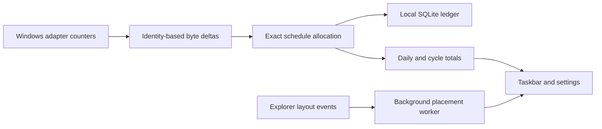

# NetPulse

**Your connection, your data plan, your taskbar.**

NetPulse is a small native Windows network monitor for people whose data plans do not fit a fixed schedule. See live upload/download speeds and today's totals on the taskbar, define your own peak/off-peak hours, and adjust cycle usage to match your provider. Your history stays on your computer.

Created by [Avishka Udara](https://github.com/avishka-Udara). Free software under [GNU GPLv3](LICENSE).

## What makes NetPulse different

- **Your plan, your rules:** overnight peak/off-peak windows, separate allowances, configurable monthly resets, and manual adjustments.
- **Compact visibility:** a transparent, customizable taskbar widget with live speeds and daily totals. A tray fallback keeps tracking available when space cannot be verified.
- **Resets without losing history:** reset today's display or the billing cycle independently while preserving the original traffic ledger.
- **Native and local:** C11, Win32/GDI, and SQLite. No embedded browser, background server, account, analytics, or cloud storage.
- **Inspectable accounting:** integer byte counters, explicit adapter selection, regression tests, matching source archives, and documented measurement limits.

## Techniques behind it

| Area | Implementation |
| --- | --- |
| Measurement | Windows IP Helper 64-bit counters, identity-based adapter tracking, per-direction reset handling, and physical/default-route filtering |
| Time allocation | Exact, overflow-safe integer proportional allocation; the remainder stays in the final segment so bytes are conserved |
| Persistence | SQLite WAL, minute buckets, batched transactions, a bounded retry backlog, and incremental totals |
| Placement | Separate accessibility worker, Explorer-scoped layout events, one-second throttling, 15-second periodic fallback, conservative gap selection |
| Rendering | Reusable widget back buffer, cached fonts, native keyboard-accessible controls, and repositioning only when geometry changes |
| Privacy | Local files only; monitoring needs no outgoing request. Opening the developer link is an explicit user action |



## Install and run

**Version 1.1.1 is an unsigned Windows release candidate.** Windows 10/11 x64 is the current target. macOS/Linux are planned ports, not supported builds.

| Package | Purpose |
| --- | --- |
| `NetPulse-1.1.1-windows-x64-setup.exe` | Per-user installer, Start menu entry, upgrades and uninstall; no administrator rights required |
| `NetPulse-windows-x64.zip` | Portable app; extract before running |
| `NetPulse-1.1.1-source.zip` | Matching GPL source and build scripts |
| `SHA256SUMS.txt` | Package checksums |

Published binaries belong in [GitHub Releases](https://github.com/Avishka-Udara/NetPulse/releases). A source push does not itself create a release. Successful [CI runs](https://github.com/Avishka-Udara/NetPulse/actions) also produce artifacts.

Exit an older running copy before updating. Installer and portable builds normally use the same local data folder. Uninstall preserves usage history. Click the widget or tray icon for settings; right-click for the menu. The top-right **?** opens Help and About.

Enable **Taskbar > Start with Windows > On - at sign-in**, then save, to start quietly. Windows Startup Apps can independently disable registration. Re-enable startup after moving a portable executable.

```powershell
# Separate profile; the parent directory must exist.
.\NetPulse.exe --data-dir "C:\MyProfiles\NetPulse"
# Start quietly.
.\NetPulse.exe --background
# Save pending traffic and exit normally.
.\NetPulse.exe --quit
```

Only one instance runs at a time. A normal second launch opens the existing settings window.

## Customization

| Page | Controls |
| --- | --- |
| Overview | Daily upload/download, speeds, cycle totals, next reset, CSV export |
| Data plan | Typed HH:MM or half-hour presets, allowances, monthly reset day/time |
| Taskbar | Position preference, fine offset, adapter, Windows startup |
| Adjust usage | Provider-aligned cycle totals, cycle reset, daily-display reset |
| Appearance | Windows/light/dark theme, transparent/solid background, width, text size, speeds with or without totals |

Both directions count toward the plan. Units are decimal: 1 GB = 1,000,000,000 bytes. K/M/G mean KB/MB/GB; `/s` identifies speed. Equal peak times mean all-day peak; overnight ranges work, zero allowance means unlimited, and reset days 29-31 clamp to shorter months. Scheduling follows Windows local time and daylight-saving rules.

Peak-hour changes affect future samples; history retains its original classification. Reset-schedule changes recompute the selected cycle. Daily-display resets persist until the next midnight and do not change raw traffic or cycle adjustments. Ctrl-drag fine-tunes widget offset, subject to detected free space. Larger text can increase minimum width.

## Accuracy and compatibility limits

**Adapter traffic is not an ISP billing meter.** LAN transfers, protocol overhead, provider rounding, other devices behind the router, and VPN topology can cause differences. Automatic mode counts physical interfaces with default routes once each, excluding loopback/filter/endpoint interfaces. Select an adapter explicitly when needed.

Sampling occurs once per second. Allocation across time boundaries is proportional because this API does not provide packet timestamps. Counter resets, reconnects, sleep, and clock changes are handled conservatively. Traffic while NetPulse is closed cannot be recovered. A full persistence backlog can pause measurement; the UI reports storage problems.

The primary-taskbar integration depends on Explorer internals. Windows offers no supported general-purpose layout API for this embedded widget. No Explorer injection, patching, or replacement is used. Unsupported or unverified layouts fall back to the tray, including vertical taskbars. Scans can briefly lag taskbar animations.

The build is unsigned. Windows 10, mixed-DPI, sign-in, Explorer-menu recovery, and long-duration behavior need broader release QA. See [VALIDATION.md](VALIDATION.md) for evidence and outstanding checks.

## Resource use

NetPulse has no browser engine or managed-runtime dependency. Sampling is independent of the placement worker. Explorer-scoped event hooks avoid callbacks from unrelated apps, container elements skip unnecessary property queries, and rendering reuses its buffer and fonts. SQLite commits in batches rather than every sample.

The previous 1.1.0 background smoke sample measured **22.55 MiB working set**, **3.75 MiB private memory**, and **0.625% of one CPU core** over 30 seconds. Working set includes shared libraries; activity, drivers, layout, and open settings affect usage. These are observations, not guarantees. The original sub-10-MiB target is not met. Version 1.1.1 measured 0.364% of one CPU core, 22.36 MiB working set, and 3.34 MiB private memory in a 30-second run. The same-session baseline was also 0.365% CPU; sustained savings are not established. See [VALIDATION.md](VALIDATION.md).

## Local data and recovery

Settings and `netpulse.db` live in `%LOCALAPPDATA%\NetPulse`, unless `--data-dir` is supplied. Adjacent `config.ini` provides first-launch defaults. CSV includes raw traffic and cycle corrections; daily-display resets do not rewrite exported traffic.

SQLite commits every 60 seconds and on normal exit, settings changes, suspend, and shutdown notifications. Forced termination may lose the uncommitted interval. Failed commits retain samples for retry; the bounded backlog reserves two slots for a boundary-spanning sample. Close NetPulse before backing up its database, or retain the WAL/SHM files together with it.

## Build, test, and package

Prerequisites: MSVC's Desktop development with C++ workload, or LLVM-MinGW extracted under `tools/`; Python for supplementary SQL tests; Inno Setup 6.7+ for installers; PowerShell for packaging.

```powershell
.\build.bat
python tests/test_sql.py
.\build\test_startup.exe
.\build\test_network.exe --live
.\tools\package.ps1 -Iscc "C:\Program Files (x86)\Inno Setup 6\ISCC.exe"
```

The build runs core, database, network, settings, and placement tests. The separate startup integration test redirects the registry inside its own process and never modifies the real Run entry. The live counter test requires an active adapter. SQLite 3.53.4 source is included; `tools/fetch-sqlite.ps1` restores the checksum-pinned amalgamation if needed. CI includes Windows tests/packaging and portable core/SQL checks on Linux; that job does not build a Linux desktop app.

| Source | Responsibility |
| --- | --- |
| `core.c` | Schedules, counter deltas, exact byte allocation |
| `network.c` | Windows counters and adapter selection |
| `db.c` | Ledger, transactions, corrections, daily resets, export |
| `taskbar.c`, `placement.h` | Background layout discovery and gap selection |
| `ui.c` | Widget rendering and native settings |
| `settings.c`, `startup.c`, `main.c` | Configuration, startup registration, lifecycle |

## Contribute and distribute

See [CONTRIBUTING.md](CONTRIBUTING.md), [RELEASE.md](RELEASE.md), and the [macOS/Linux roadmap](ROADMAP.md). Include Windows version, display scaling, reproduction steps, and expected behavior in issues. Do not upload usage databases or credentials.

NetPulse is **GPL-3.0-only**. Distribute matching source with binaries and preserve [third-party notices](THIRD_PARTY_NOTICES.md). SQLite is public domain; runtime notices are included separately.
